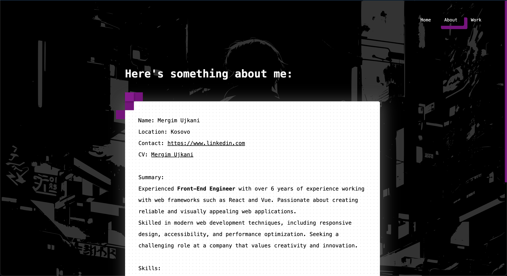

# Portfolio Website - mergimujkani.com

This repository contains the source code for my personal portfolio website, accessible at [mergimujkani.com](https://mergimujkani.com/home).

## Overview

This website is designed to showcase my skills, experience, and projects through a clean and intuitive interface. It features three core sections:

- **Home:** A welcoming introduction and overview of my expertise.
- **About:** Detailed information about my background, skills, and professional journey.
- **Work:** A curated collection of my projects, demonstrating my capabilities and accomplishments.

## Features

- Clean and responsive design, ensuring optimal viewing experience across various devices.
- Clear navigation for easy access to different sections.
- Visual representation of projects and skills through images and descriptions.

## Screenshots

Below are previews of the main sections of the website:

**Home:**

**About:**

**Work:**

## Technologies Used (Optional, but highly recommended)

_(Add the technologies used. For example:)_

- React.js
- TypeScript
- CSS
- REST API
- (Add any libraries or frameworks)

## Getting Started (Optional, if applicable)

If you'd like to run this project locally, follow these steps:

1.  Clone the repository: `git clone [repository URL]`
2.  Navigate to the project directory: `cd [project directory]`
3.  Install dependencies: `npm install` or `yarn install`
4.  Start the development server: `npm start` or `yarn start`
5.  Open your browser and navigate to `http://localhost:3000` (or the appropriate port).

## Contributing (Optional)

If you have suggestions or would like to contribute to this project, please feel free to submit a pull request.

## Author

- Mergim Mujkani - [mergimujkani.com](https://mergimujkani.com/home)
